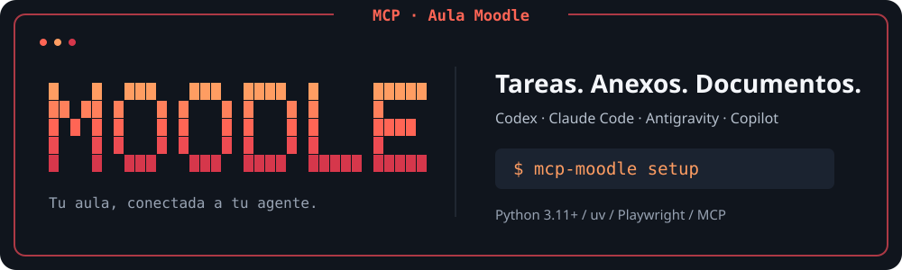
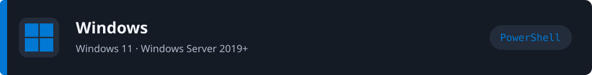
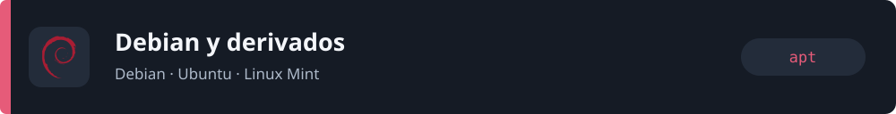
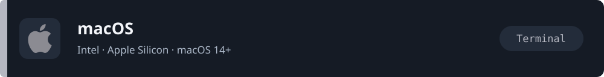

<p align="center">
  
</p>

<h1 align="center">Moodle MCP</h1>

<p align="center">
  Conecta tu cuenta de Moodle con tu agente y trabaja desde una sola conversación.
</p>

<p align="center">
  <a href="#instalacion">Instalación</a> ·
  <a href="#desde-un-clon">Desde un clon</a> ·
  <a href="#consultar-tareas">Consultar tareas</a> ·
  <a href="docs/MCP.md">Guía MCP</a> ·
  <a href="docs/DOCUMENT_OUTPUT.md">Documentos</a>
</p>

| Consulta tus tareas | Descarga los anexos | Prepara tus documentos |
| :--- | :--- | :--- |
| Próximas cinco pendientes, materia y tiempo restante. | Descarga autenticada con la misma sesión de Moodle. | DOCX y PDF con portada ULEAM, APA 7 y Times New Roman. |

Compatible con **Codex, Claude Code, Google Antigravity y Copilot**. Usa Python, `uv` y Playwright. Las instrucciones y los anexos se consultan cuando eliges una tarea para trabajar en ella.

---

## Requisitos

- Windows 11 o Windows Server 2019+, macOS 14+, o Linux con las bibliotecas necesarias para Chromium. El CI comprueba Windows Server 2025, Ubuntu 24.04, Arch Linux y macOS 15 en Intel y Apple Silicon.
- `uv`; obtiene Python 3.11 automáticamente si hace falta.
- Una cuenta activa en Moodle, acceso a Internet y un agente compatible instalado.

Los requisitos del navegador se basan en la [documentación oficial de Playwright](https://playwright.dev/python/docs/intro).

<a id="instalacion"></a>

## Elige tu sistema

La unica instalacion soportada consiste en clonar este repositorio con Git. Consulta [INSTALL.md](docs/INSTALL.md).

<table>
  <tr>
    <td align="center"><a href="#windows"><br><strong>Windows</strong></a><br>PowerShell</td>
    <td align="center"><a href="#debian"><br><strong>Debian y derivados</strong></a><br>apt</td>
    <td align="center"><a href="#arch"><br><strong>Arch y derivados</strong></a><br>pacman</td>
    <td align="center"><a href="#macos"><br><strong>macOS</strong></a><br>Intel / Apple Silicon</td>
  </tr>
</table>

Instala `uv` siguiendo el bloque de tu sistema y abre una terminal nueva. Los comandos de instalación de `uv` proceden de su [guía oficial](https://docs.astral.sh/uv/getting-started/installation/).

---

<a id="windows"></a>



### Windows — PowerShell

Clona el repositorio y entra en su carpeta:

```powershell
git clone https://github.com/ElkinDelgado25/Moodle_Homework_assignment.git
cd .\Moodle_Homework_assignment
```

Luego ejecuta el instalador incluido:

```powershell
powershell -ExecutionPolicy Bypass -File .\INSTALAR-WINDOWS.ps1
```

El instalador prepara `uv`, instala las dependencias, descarga Chromium y abre el asistente para configurar Moodle y conectar un agente.

### Configurar otra cuenta o mas agentes

Desde la carpeta del repositorio ejecuta:

```powershell
uv run mcp-moodle setup
```

El asistente permite cambiar las credenciales o conectar otro agente.

---


<a id="debian"></a>



### Debian y derivados

1. Clona el repositorio:

   ```bash
   git clone https://github.com/ElkinDelgado25/Moodle_Homework_assignment.git
   ```

2. Entra en la carpeta del repositorio:

   ```bash
   cd Moodle_Homework_assignment
   ```

3. Ejecuta el instalador:

   ```bash
   bash ./INSTALAR-LINUX.sh
   ```

El instalador prepara `uv`, las bibliotecas de Chromium y abre el asistente de Moodle. Puede pedir la contrasena de `sudo`.

Para configurar otra cuenta o conectar mas agentes:

```bash
uv run mcp-moodle setup
```

---

<a id="arch"></a>


### Arch Linux y derivados

1. Clona el repositorio:

   ```bash
   git clone https://github.com/ElkinDelgado25/Moodle_Homework_assignment.git
   ```

2. Entra en la carpeta del repositorio:

   ```bash
   cd Moodle_Homework_assignment
   ```

3. Ejecuta el instalador:

   ```bash
   bash ./INSTALAR-LINUX.sh
   ```

El instalador prepara `uv`, instala el paquete `chromium` y abre el asistente de Moodle. Puede pedir la contrasena de `sudo`.

Para configurar otra cuenta o conectar mas agentes:

```bash
uv run mcp-moodle setup
```

---

<a id="macos"></a>



### macOS — Intel y Apple Silicon

```bash
curl -LsSf https://astral.sh/uv/install.sh | sh
```

En una ventana nueva de Terminal, desde la carpeta del wheel:

```bash
uv tool install --python 3.11 ./moodle_homework_assignment-0.1.0-py3-none-any.whl
uv tool update-shell
```

Abre Terminal de nuevo y ejecuta `mcp-moodle run`. Usa una terminal nativa de tu Mac; `uv` y Playwright descargan Python y Chromium para su arquitectura. El asistente guarda la cuenta en `~/Library/Application Support/moodle-homework-assignment/`.

El asistente pide tu cuenta, intenta validarla, prepara Chromium y te permite elegir el agente. Sigue [los pasos completos de instalación](docs/INSTALL.md), incluida la alternativa desde GitHub, la actualización y los instaladores disponibles en Actions.

`mcp-moodle run` muestra el panel de Aula Moodle. Si ya tienes una cuenta guardada, elige **4. Validar cuenta** para comprobar el acceso. También puedes usar `mcp-moodle status`.

---

<a id="desde-un-clon"></a>

## Ejecutar desde un repositorio clonado

Si clonaste este repositorio, abre PowerShell o una terminal dentro de la carpeta `Moodle_Homework_assignment` y ejecuta un único comando:

```powershell
uv run mcp-moodle setup
```

Este comando instala automáticamente las dependencias indicadas en `uv.lock`, prepara Chromium y abre el asistente para guardar tu cuenta de Moodle y elegir el agente que quieres conectar. No hace falta ejecutar `uv sync`, crear un archivo `.env` ni instalar Chromium por separado para usar el asistente.

No ejecutes `mcp-moodle setup` sin `uv run` desde un clon: ese comando solo existe directamente en la terminal cuando el paquete se instaló de forma global.

Cuando ya hayas terminado la configuración, puedes volver a abrir el panel con:

```powershell
uv run mcp-moodle run
```

Y consultar las tareas desde la terminal con:

```powershell
uv run mcp-moodle tasks
```

<a id="consultar-tareas"></a>

## Consultar y resolver tareas

Por defecto muestra las próximas cinco tareas **ya abiertas y con plazo vigente** desde la línea de tiempo del Área personal, usando el cierre y el botón «Agregar entrega» para confirmar disponibilidad. No abre las actividades ni consulta instrucciones o anexos. Excluye vencidas y actividades que todavía no se habilitan. En el agente la respuesta comienza con **Estas son las tareas pendientes** y una sola tabla con **Tarea, Materia y Cierre (fecha y hora)**. Cada cierre incluye el tiempo restante calculado al consultar, por ejemplo `11/10/2026 23:59 (quedan 3 días y 8 horas)`. Para otras búsquedas:

```bash
uv run mcp-moodle tasks --mode overdue
uv run mcp-moodle tasks --mode all --refresh
```

### Herramientas disponibles

En MCP, `list_assignments` hace la consulta limitada y **`list_all_assignments(complete_review=true)`** es la herramienta separada para contar o revisar pendientes en todas las materias visibles cuando se solicita explícitamente. Sin ese parámetro devuelve las próximas cinco pendientes, incluso si el agente elige por error esa herramienta para una pregunta general. La revisión completa usa únicamente los índices de tareas por materia: cuenta entregas pendientes sin abrir actividades ni leer anexos. Los índices no confirman cuándo se abre cada tarea; por eso los contadores de disponibilidad son `null` en la revisión completa.

**`get_assignment(assignment_id=...)`** es la herramienta para profundizar en una tarea: devuelve instrucciones, fechas, estado y enlaces de anexos. Se utiliza cuando pides más información o dices «hagamos la primera tarea», con el ID del enlace de esa fila en la última tabla. No se vuelve a buscar en todas las materias.

**`download_assignment_attachments(assignment_id=..., destination_directory=...)`** descarga los anexos con la misma automatización de Playwright y las cookies de la sesión de Moodle. Si no indicas carpeta, usa `~/Documentos` si existe o `~/Documents`. Devuelve las rutas locales para que el agente lea el material y continúe la tarea. No requiere `curl`, scripts externos ni exportar cookies. Si la sesión vence durante la lectura o descarga, intenta renovarla una vez; rechaza páginas HTML y archivos que se anuncian como PDF sin tener su firma. Conserva los archivos existentes usando otro nombre e informa las descargas parciales.

Pedir al agente «descarga los anexos en Documentos y resuelve esta tarea» autoriza ese trabajo. El cliente puede exigir permisos para herramientas que escriben archivos; el MCP declara la descarga como escritura local y no cambia las políticas de aprobación del cliente. Reinicia el MCP después de actualizar para que el agente descubra la herramienta nueva.

### Entregables: DOCX y PDF

Al resolver una tarea documental, el agente entrega por defecto **solo DOCX y PDF**, con el mismo nombre base, aplicando **APA 7 y Times New Roman de 12 puntos** al desarrollo. Usa **`get_document_template()`** para obtener la portada ULEAM con logo, numeración y campos de Materia, Docente, Estudiantes, Carrera, Curso y Año. La portada institucional se conserva como adaptación a APA y el desarrollo empieza en la segunda página. Los datos personales se pueden conservar en un perfil local; la plantilla pública tiene campos vacíos. Las fuentes, conversiones y capturas de revisión se guardan como temporales. Consulta [la política de documentos y portada](docs/DOCUMENT_OUTPUT.md).

### Detalles de ejecución

La vista superficial ordena por cierre; `recent` requiere datos de apertura que no aparecen en los listados y devuelve una explicación para usar `upcoming`. El motor interno conserva la lectura detallada para usos explícitos de desarrollo, pero las herramientas de listado y la terminal usan `summary_only=True`.

Para desarrollo avanzado, `uv sync` crea el entorno del proyecto y `uv run playwright install chromium` permite instalar Chromium de forma independiente.

Ubuntu 24.04 tiene soporte oficial de Playwright. En Arch Linux y sus derivadas puede aparecer esta advertencia:

```text
BEWARE: your OS is not officially supported by Playwright; downloading fallback build for ubuntu24.04-x64.
```

No es un error: indica que Playwright usa una compilación de Chromium para Ubuntu 24.04 como alternativa. En este equipo se comprobó que Chromium inicia correctamente. Si aparece solo esta advertencia y el comando termina sin errores, puedes continuar.

El asistente guarda las credenciales en la configuración local del usuario. Si usas el modo de desarrollo heredado con `.env`, no compartas ni subas ese archivo: está incluido en `.gitignore`.

## Ejecución directa con variables de entorno

Para el modo de desarrollo heredado basado en `.env`, ejecuta desde la carpeta del proyecto:

```bash
uv run moodle-tasks
```

`uv run` ejecuta el programa dentro del entorno de Python del proyecto, sin tener que activarlo manualmente.

El programa consulta Moodle una vez y avisa por la terminal. Puedes volver a ejecutarlo cuando enciendas la computadora. Para ver el navegador durante una prueba, cambia `MOODLE_HEADLESS=false` en `.env`.

Referencias: [sistemas compatibles con Playwright](https://playwright.dev/python/docs/intro) y [ejecución de comandos con uv](https://docs.astral.sh/uv/concepts/projects/run/).

## Integración con agentes mediante MCP

El servidor `mcp-moodle serve` usa el SDK oficial de MCP para Python y expone herramientas de consulta para Codex, Claude, Antigravity, Copilot y otros clientes compatibles con `stdio`. Usa `mcp-moodle run` para configurarlo o consulta [la guía de conexión manual y herramientas](docs/MCP.md). El repositorio incluye configuración para Copilot en `.vscode/mcp.json` y un ejemplo para Claude Desktop.

## CI e instaladores de esta entrega

El [workflow multiplataforma](.github/workflows/tests.yml) construye el wheel, lo instala y ejecuta la suite completa en cinco entornos: Ubuntu 24.04, Arch Linux, Windows Server 2025, macOS 15 Apple Silicon y macOS 15 Intel. Las pruebas usan credenciales ficticias y páginas de prueba.

GitHub Actions se usa solo para verificar el proyecto en varios sistemas. Para instalarlo, clona este repositorio y sigue los pasos anteriores.

## Notas

- Si Moodle responde con un error como `HTTP 502`, la consulta no se completó. Vuelve a intentarlo cuando el servidor esté disponible.
- La búsqueda rápida respeta el filtro de la línea de tiempo; la completa consulta los índices de las materias visibles en Mis cursos. Ambas muestran su alcance. Si no encuentra resultados, no puede descartar tareas fuera de esa cobertura.
- Para identificar pendientes comprueba los datos de entrega y nota disponibles en los listados: una actividad ya calificada o que indique no subir documentos no se cuenta como pendiente solo por figurar sin entrega.
- Las cuentas institucionales de ULEAM usan Microsoft 365 y la selección del mismo perfil cuando aparece «Use a different account». Si Microsoft exige CAPTCHA, códigos o verificación adicional, el programa no los resuelve ni afirma que la sesión esté validada.
- El programa no entrega tareas ni modifica información en Moodle.

---

<p align="center">
  <a href="docs/INSTALL.md">Instalación completa</a> ·
  <a href="docs/MCP.md">Conexión de agentes</a> ·
  <a href="docs/assets/readme/SOURCES.md">Créditos visuales</a>
</p>
